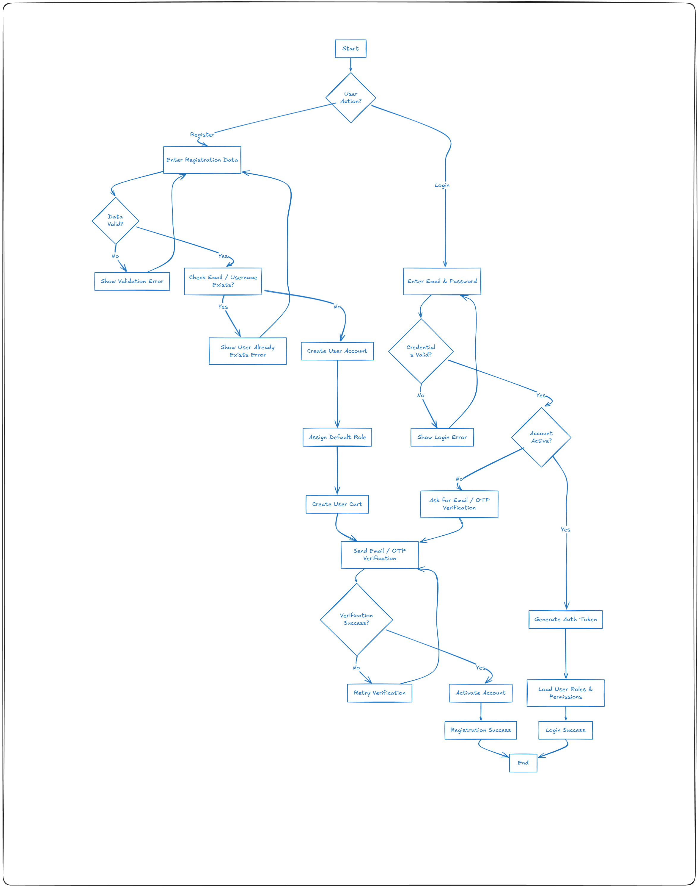
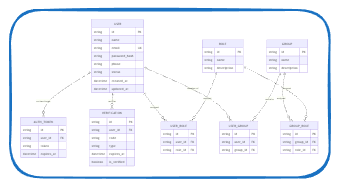

# 🍔 Food Delivery System – README

## 📌 Project Overview
The **Food Delivery System** is a complete platform that connects customers with restaurants.
It allows users to browse restaurants and menus, add items to a cart, place orders,
make online payments, and track order status in real time.

This project is designed following **Software Engineering principles**, including:
- Use Cases
- Flowcharts
- Sequence Diagrams
- Entity Relationship Diagrams (ERD)
- Pseudocode

---
## 📚 Project Documentation

This project includes detailed technical documentation covering API design,
system diagrams, pseudocode, and development estimates.

### 🔹 API Design
- Complete API design documentation for all system modules
  📄 `API_Design.md`

### 🔹 Order Management Estimate
- Time estimation and task breakdown for Order & Payment Management
  📄 `Order_Estimate.md`

## 🚀 Features & Functions

### 1️⃣ Cart Management
**Features**
- One cart per user
- Cart is created on user registration or on first item insertion
- In-memory caching using Redis
- Persistent storage in the database

**Functions**
- Add item to cart
- Modify cart
- Update item quantities
- View cart
- Remove item from cart
- Clear cart
- Checkout

---

### 2️⃣ User Registration & Authentication
**Features**
- Complete user account management
- Email or OTP verification
- Social media authentication
- Role-Based Access Control (RBAC)

**Functions**
- Sign up
- Login
- Logout
- Forgot password
- Email / OTP verification
- Enable / Disable account
- Role-based authorization

---

### 3️⃣ Restaurant Management
**Features**
- Full restaurant lifecycle management
- Enable / Disable restaurants
- Restaurant browsing for customers
- Advanced search with filters
- Top-rated restaurants
- Restaurant recommendations

**Functions**
- Add restaurant
- Update restaurant
- Enable / Disable restaurant
- View all restaurants
- Search restaurants
- Top-rated restaurants
- Restaurant recommendations

---

### 4️⃣ Menu Management
**Features**
- Complete menu management
- Support for categories and ingredients
- Menu change history tracking

**Functions**
- Create menu
- Update menu
- Delete menu
- View menu list
- View menu history
- Search menu items
- CRUD menu categories
- CRUD ingredients
- View ingredients (customers)

---

### 5️⃣ Order Management
**Features**
- Full order lifecycle
- Order status tracking
- Order history for customers and restaurants
- Order notifications

**Functions**
- Place order
- Cancel order (customer / restaurant)
- Update order status
- Track order
- View order history
- View order details
- Order summary
- Email / SMS order confirmation

---

### 6️⃣ Customer Management
**Features**
- Customer profile management
- Multiple delivery addresses
- Preferred payment methods
- Customer feedback and ratings
- Customer support

**Functions**
- Manage profile
- Manage delivery addresses
- Set preferred payment methods
- Rate restaurants and orders
- View order history
- Track current orders
- Deactivate account
- Customer support chat

---

### 7️⃣ Payment Integration
**Features**
- Integration with third-party payment gateways
- Multiple payment methods
- Secure payment verification
- Transaction auditing

**Functions**
- Initiate payment
- Verify and validate payment
- Handle payment failures
- Store transaction records
- Generate payment receipts
- Payment status tracking
- Audit payment transactions

---

### 8️⃣ Dashboard & Analytics
**Features**
- System-level dashboard
- Restaurant-level dashboard
- Real-time statistics and reports

**Functions**
- Count restaurants
- Count customers
- Daily and total order statistics
- Daily and total canceled orders
- Daily and total transaction amounts
- Generate daily and monthly reports
- Restaurant-specific performance reports

---

## 📊 User Registration & Login – Diagrams

### 🔹 Flowchart


### 🔹 Sequence Diagram


### 🔹 Entity Relationship Diagram (ERD)


---

## 🧠 Pseudocode – User Registration & Login

```
BEGIN UserRegistration
INPUT userData
IF data invalid THEN RETURN error
IF email exists THEN RETURN error
HASH password
CREATE user (INACTIVE)
ASSIGN default role
SEND verification code
IF verified THEN ACTIVATE user
RETURN success
END

BEGIN UserLogin
INPUT email, password
IF user not found THEN RETURN error
IF password invalid THEN RETURN error
IF account not active THEN RETURN verification required
GENERATE auth token
RETURN success
END
```

---


## ✅ Conclusion
This project demonstrates a well-structured approach to system analysis and design,
covering all required diagrams and documentation for the **Food Delivery System**.
